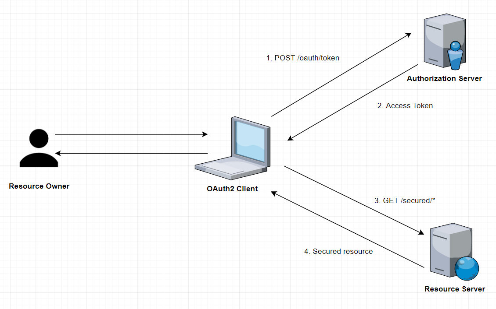

# pyramid-game-security-oauth2
Secure REST API with OAUTH2 and JWT with Nimbus for Authentication

## Getting started
### Prerequistes:
- Spring Boot 3.4.1
- Spring Security 6
- Java 17
- PostgreSQL 16.3
- FlywayDB

**Note:** _we don't use spring security dependency, instead we use OAuth2 Resource Server. Because it contains Nimbus which could be used for generating and managing JWT_

### Api Request Flow


### Creating public and private keys for encryption and decryption
In the resources directory create a folder named **_certs_**, and then open the terminal in that directory and run the following commands:
We use OpenSSL to generate an RSA-Key keypair.
* Generate a Private Key (RSA):
    ```bash
       openssl genpkey -algorithm RSA -out private-key.pem
    ```
* Extract the Public Key from the Private Key by running:
    ```bash
       openssl rsa -pubout -in private-key.pem -out public-key.pem
    ```
* Convert to PCKS format
    ```bash
       openssl pkcs8 -topk8 -inform PEM -outform PEM -in private-key.pem -out private-key.pem -nocrypt
    ```

You can see [Api documentation](http:127.0.0.1:6300/swagger-ui/index.html) locally.